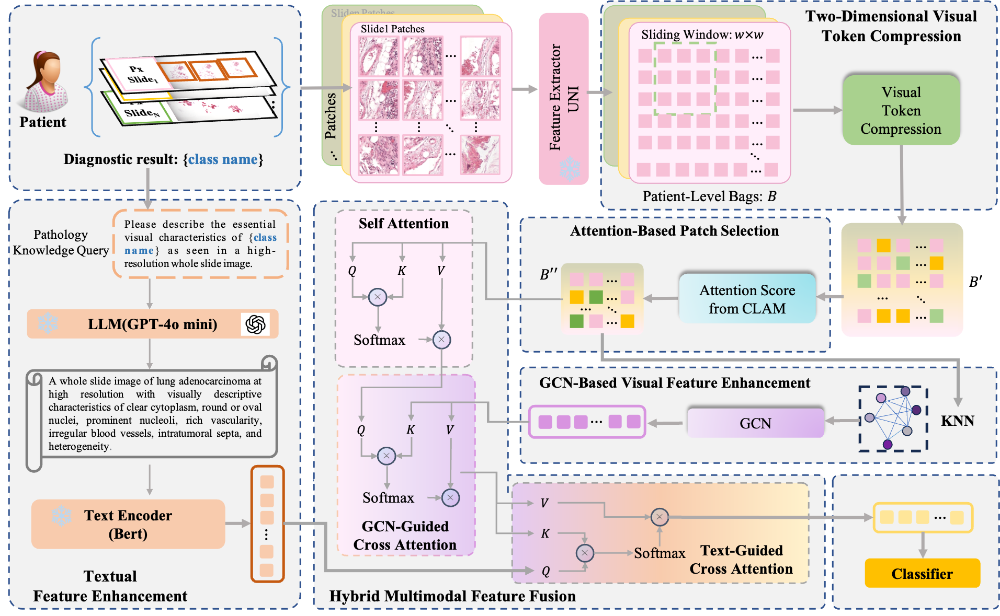

# EmmPD

Efficient Multi-Slide Visual-Language Feature Fusion for Placental Disease Classification, **ACM MM'25**\
*Hang Guo, Qing Zhang, Zixuan Gao, SIYUAN YANG, Shulin Peng, Tao Xiang, Ting Yu, Yan Wang, Qingli Li*

[[ArXiv]]()



## 1. Installation
```Shell
conda create -n EmmPD python=3.9 -y
conda activate EmmPD
pip install --upgrade pip 
pip install -r requirements.txt
```

## 2. Reproduce EmmPD
This repository is based on the Pytorch version of the EmmPD implementation.

We have provided the model implementation and training code, with detailed instructions shown as follows:

### 2.1 Dataset
We've inlcuded three datasets in this study, *i.e.*, two publicly available datasets, TCGA-Lung, CAMELYON+, and our in-house Placenta dataset. Here provides the download link to public dataset:
- TCGA-Lung:  [NIH Genomic Data Commons Data Portal](https://portal.gdc.cancer.gov/).
- Camelyon+: [Camelyon+](https://doi.org/10.57760/sciencedb.16442/)

### 2.2 Preprocessing
For WSI preprocessing, please refer to [CLAM](https://github.com/mahmoodlab/CLAM), where we set the patch size to 512.

For obtaining patch feature embeddings, please note that we use [UNI](https://github.com/mahmoodlab/UNI) as the feature extractor for experiments in this study.

### 2.3 Running Experiments
🌟 Download pretrained Bert: [HuggingFace Repo](https://www.huggingface.co/bert-base-uncased). After downloading, put it under the `ckpts` folder.

Experiments can be run using the following generic command-line:
### Training model
#### Two-Dimensional Visual Token Compression
```shell
python ./2Dcompression/2Dcom.py
```
```shell
python main.py --mode 'Train' --base_dir <DATASET BASE PATH> --image_dir <SLIDE FEATURE PATH> --ann_path <LABEL PATH> --dataset_name 'TCGA'
```
### Testing model
```shell
python main.py --mode 'Test' --base_dir <SLIDE FEATURE PATH> --image_dir <SLIDE FEATURE PATH> --ann_path <LABEL PATH> --dataset_name 'TCGA'
```

## Acknowledgment
This codebase is based on [WsiCaption](https://github.com/cpystan/Wsi-Caption/tree/master) and [CLAM](https://github.com/mahmoodlab/CLAM). Many thanks to the authors of these great projects!

## Issues
- Please open new threads or report issues directly (for urgent blockers) to `51285904046@stu.ecnu.edu.cn`

## Reference
If you find our work useful in your research, please consider citing our paper at::
```
```
